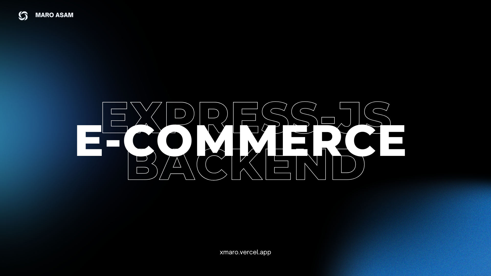

# Express.js Backend for Ecommerce Store

Building an eCommerce backend with **Express.js** provides a flexible and scalable solution for managing **products, orders, users, and payments**. Express.js, a minimal and fast **Node.js** framework, allows developers to create **RESTful APIs** efficiently.

## 🚀 Key Features:

- **User Authentication** – Secure login, registration, and role-based access control.
- **Product Management** – CRUD operations for products, categories, and inventory.
- **Order Handling** – Managing customer orders, order status updates, and tracking.
- **Payment Integration** – Secure payment processing with **Stripe**, **PayPal**, or other gateways.
- **Admin Dashboard Support** – APIs to facilitate product and order management by admins.
- **Security & Performance** – Implementing authentication, input validation, and caching.

## 🛠 Technology Stack:

- **Backend:** Express.js (Node.js)
- **Database:** MongoDB (Mongoose) or PostgreSQL (Sequelize)
- **Authentication:** JWT (JSON Web Tokens) & bcrypt
- **Payment:** Stripe or PayPal API
- **Deployment:** Docker, PM2, and cloud hosting services

By structuring the backend with **RESTful APIs**, middleware, and controllers, we can create a **scalable and maintainable** eCommerce platform that efficiently handles user interactions and transactions.

---

### Ready to Get Started?

Would you like me to generate some **starter code** for this setup? 🚀
